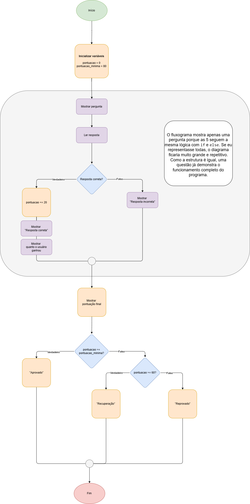

# Quiz Python

## Descrição do projeto

O Quiz Python é um programa de perguntas e respostas sobre conceitos básicos da linguagem Python. É um programa executado no terminal que testa conhecimentos iniciais sobre Python por meio de 5 perguntas de múltipla escolha. Cada questão vale 20 pontos, totalizando 100 pontos possíveis. Após as 5 perguntas, o programa mostra a pontuação final.

### 🎯 Sistema de Pontuação

- 80 pontos ou mais → Aprovado
- 40 a 60 pontos → Recuperação
- 20 pontos ou menos → Reprovado
- Pontuação máxima: 100 pontos

Este projeto foi desenvolvido como prática de lógica de programação e fundamentos da linguagem Python.

## Funcionalidades

- Guardar as perguntas, alternativas e a resposta correta
- Mostrar a pergunta na tela
- Ler a resposta do usuário
- Conferir se está certa
- Somar pontos
- Mostrar se o usuário fez a pontuação o suficiente para ser aprovado, reprovado ou estará de recuperação.

## Lógica e Variáveis

O sistema utiliza as seguintes variáveis para o processamento:
| Variável | Descrição | Tipo de Dado |
| :--- | :--- | :--- |
| `pontuacao` | Armazena a pontuação acumulada do usuário durante o quiz | `int` |
| `pontuacao_mínima` | Define a pontuação mínima necessária para aprovação | `int` |
| `resposta_1` | Recebe a resposta da questão 1 do usuário | `str` |
| `resposta_2` | Recebe a resposta da questão 2 do usuário | `str` |
| `resposta_3` | Recebe a resposta da questão 3 do usuário | `str` |
| `resposta_4` | Recebe a resposta da questão 4 do usuário | `str` |
| `resposta_5` | Recebe a resposta da questão 5 do usuário | `str` |

## Fluxograma do Projeto:

Para facilitar a compreensão do sistema, elaborei este fluxograma que detalha o caminho que a informação percorre:

## Aprendizados

Durante o desenvolvimento deste projeto, foram praticados e compreendidos os seguintes conceitos:

- Manipulação de variáveis e operadores de atribuição (+=)
- Estruturas condicionais (if, elif, else)
- Uso do método .upper() para padronizar entradas do usuário
- Uso de \n para quebra de linha em strings
- Organização lógica do programa por meio de fluxograma
- Estruturação de regras de pontuação
- Compreensão de operadores lógicos (>=, <, or)

## Como Executar o Projeto

1.  Certifique-se de ter o **Python 3.x** instalado.
2.  Faça o download ou clone este repositório.
3.  Navegue até a pasta do projeto.
4.  Execute o comando: `python main.py`.

## Tecnologias Utilizadas

- Linguagem: Python 3.x
- Ferramentas: VS Code
- Modelagem: Draw.io (para o fluxograma)

## Autores

**Fernanda Matos** – Desenvolvimento Web e Mobile – Python Iniciante.
