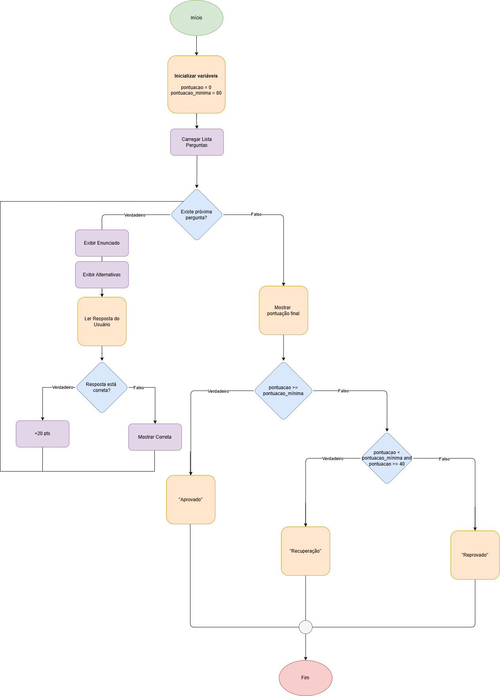

# Quiz Python

## Descrição do projeto

O Quiz Python é um programa de perguntas e respostas sobre conceitos básicos da linguagem Python. É um programa executado no terminal que testa conhecimentos iniciais sobre Python por meio de 5 perguntas de múltipla escolha. Cada questão vale 20 pontos, totalizando 100 pontos possíveis. Após as 5 perguntas, o programa mostra a pontuação final.

### 🎯 Sistema de Pontuação

- 80 pontos ou mais → Aprovado
- 40 a 79 pontos → Recuperação
- 20 pontos ou menos → Reprovado
- Pontuação máxima: 100 pontos

Este projeto foi desenvolvido como prática de lógica de programação e fundamentos da linguagem Python.

## Histórico de Versões
### [v2.0.0](https://github.com/ferlimatos/ABPJ2-Jogo_Logico/tree/main) - Refatoração e Estruturas de Dados (Atual)
Esta versão foca em Clean Code e escalabilidade, substituindo a lógica linear por estruturas repetíveis.
- Adicionado: Uso de dicionários e listas para centralizar os dados do programa.
- Melhoria (Lógica): Implementação de laços for para processamento automatizado, eliminando redundância.
- Interface: Aplicação de f-strings para mensagens mais dinâmicas e legíveis.

### [v1.0.0](https://github.com/ferlimatos/ABPJ2-Jogo_Logico/tree/v1-sequencial) - Versão Sequencial (MVP)
A primeira versão funcional focada na lógica básica de programação.
- Adicionado: Estrutura de controle de fluxo (if/elif/else) e operadores lógicos.
- Tratamento de Dados: Normalização de entradas com .upper() e uso de sequências de escape (\n).
- Fundamentos: Implementação de contadores de pontuação e operadores de atribuição.

## Funcionalidades

- Escalabilidade: Perguntas armazenadas em estruturas de dicionários.
- Automação: Processamento automático de perguntas e alternativas via loops.
- Feedback em Tempo Real: Informa se o usuário acertou ou errou imediatamente após cada resposta.
- Normalização de Dados: Tratamento de entradas (maiusculas/minusculas) para evitar erros de digitação.

## Lógica e Variáveis

O sistema foi otimizado para não utilizar variáveis isoladas para cada resposta. Agora, utilizamos:
| Variável | Descrição | Tipo de Dado |
| :--- | :--- | :--- |
| `perguntas` | Lista contendo dicionários com enunciado, opções e resposta correta | `list[dict]` |
| `pontuacao_mínima` | Define a pontuação mínima necessária para aprovação | `int` |
| `pontuacao` | Acumulador de pontos do usuário | `int` |
| `pergunta` | Variável de controle do laço que representa a questão atual | `iterator` |

## Fluxograma do Projeto:

O fluxo agora conta com uma estrutura de repetição que valida cada pergunta antes de seguir para o resultado final:

## Evolução e Aprendizados
O projeto foi desenvolvido em etapas para demonstrar a transição de uma lógica sequencial para um código limpo e otimizado.

### 🔹 Fase 1: Lógica Linear e Condicionais (v1-sequencial)
Nesta etapa inicial, o foco foi dominar os fundamentos da linguagem:

- Controle de Fluxo: Implementação de árvores de decisão com if/elif/else e operadores lógicos para validar respostas.
- Tratamento de Dados: Uso de métodos de string como .upper() para garantir que a entrada do usuário não quebrasse o programa, independentemente de letras maiúsculas ou minúsculas.
- Experiência do Usuário (UX): Uso de sequências de escape (\n) para melhorar a legibilidade das mensagens no console.

### 🔹 Fase 2: Refatoração e Escalabilidade (v2-main)
Aqui, o objetivo foi aplicar princípios de Clean Code para tornar o programa mais curto e fácil de manter:

- Estruturas Compostas: Substituí múltiplas variáveis isoladas por Dicionários e Listas. Isso permitiu centralizar as perguntas e respostas em um único lugar.
- DRY (Don't Repeat Yourself): Com o uso de Laços de Repetição (for loops), reduzi drasticamente a repetição de código. Em vez de escrever 10 vezes um input(), o programa agora percorre a lista de dados automaticamente.
- Interpolação de Strings: Adotei f-strings, o que tornou o código mais moderno e facilitou a exibição de variáveis complexas dentro de textos.

### O que eu aprendi com isso?
- Entendi que organizar os dados (Data Structures) antes de escrever a lógica facilita muito o desenvolvimento.
- Na versão 2.0, se eu quiser adicionar mais 50 perguntas, só preciso mexer na lista de dados, sem precisar criar novas linhas de lógica.
- Aprendi que um código "funcional" nem sempre é um código "bom", e que a refatoração é uma parte essencial da vida de um programador.

## Como Executar o Projeto

1.  Certifique-se de ter o **Python 3.x** instalado.
2.  Faça o download ou clone este repositório.
3.  Navegue até a pasta do projeto.
4.  Execute o comando: `python main.py`.

## Tecnologias Utilizadas

- Linguagem: Python 3.x
- Ferramentas: VS Code
- Versionamento: Git (Estratégia de Branches para histórico de evolução)
- Modelagem: Draw.io (para o fluxograma)
## Tecnologias Utilizadas

- Linguagem: Python 3.x
- Ferramentas: VS Code
- Versionamento: Git (Estratégia de Branches para histórico de evolução)
- Modelagem: Draw.io (para o fluxograma)

## Autores

**Fernanda Matos** – Desenvolvimento Web e Mobile – Python Iniciante.
